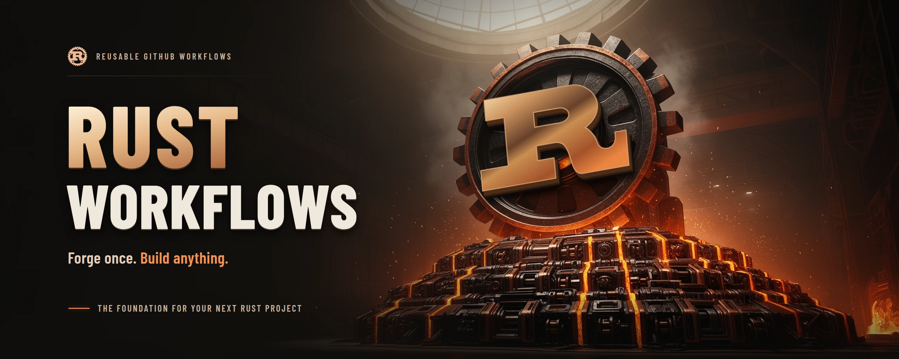
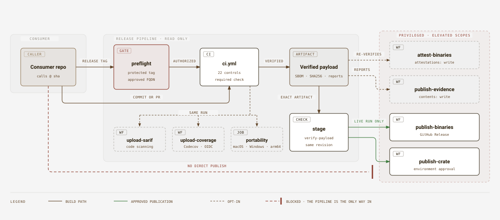

<p align="center">
  
</p>

<h1 align="center">🦀 Rust Golden Workflows</h1>

<p align="center">
  Reusable CI and protected publishing for Rust packages and workspaces.
</p>

<p align="center">
  
  
  
</p>

<p align="center">
  
  
  
  
</p>

<p align="center">
  <a href="https://github.com/Orchestration-Maestro/rust-workflows/actions/workflows/ci-internal.yml"></a>
  <a href="https://scorecard.dev/viewer/?uri=github.com/Orchestration-Maestro/rust-workflows"></a>
  <a href="https://codecov.io/gh/Orchestration-Maestro/rust-workflows"></a>
</p>

## ⚡ Quick start

Add one file to your Rust repository:

```yaml
# .github/workflows/ci.yml
name: CI
"on": [push, pull_request]
permissions:
  contents: read
jobs:
  rust:
    uses: Orchestration-Maestro/rust-workflows/.github/workflows/ci.yml@<reviewed-sha>
    permissions:
      contents: read
```

To see Clippy and secret-scan findings in the repository's Security tab, and
coverage and test results in Codecov, add two jobs; each alone holds its write
scope:

```yaml
  sarif:
    needs: rust
    uses: Orchestration-Maestro/rust-workflows/.github/workflows/upload-sarif.yml@<reviewed-sha>
    permissions:
      contents: read
      security-events: write
    with:
      artifact-name: ${{ needs.rust.outputs.artifact-name }}
  coverage:
    needs: rust
    uses: Orchestration-Maestro/rust-workflows/.github/workflows/upload-coverage.yml@<reviewed-sha>
    permissions:
      contents: read
      id-token: write
    with:
      artifact-name: ${{ needs.rust.outputs.artifact-name }}
```

Codecov needs its GitHub App installed on the organization; the upload logs in
through OIDC, so there is no Codecov token to store.

That is the whole adoption. Every run enforces formatting, Clippy, tests,
rustdoc, 80% line coverage, advisories, a secret scan, the declared MSRV,
dependency sources and versions, a reproducible hardened release build and both
SBOM formats. Five more gates are on by default and each is one input to switch
off: mutation testing, the unused-dependency check, the `unsafe` ban, SARIF
reports and public API compatibility. The full list is under [gates](#-gates). Semantic security analysis is CodeQL default
setup, enabled by organization administrators rather than by this workflow; see
[platform requirements](docs/platform-requirements.md#administrator-owned-setup).

Replace `<reviewed-sha>` with the commit of the latest
[release](https://github.com/Orchestration-Maestro/rust-workflows/releases) and
keep its tag as a comment, `@<sha>  # v1.0.0`: Dependabot then proposes each new
release as a pull request. The organization's Rust CI template is pinned this way.

Your project needs a `rust-toolchain.toml` pinning
[an exact stable version](#-rust-versions). Point at a subdirectory with
`working-directory:` if your package is not at the repository root. Everything
else is opt-in.

Every job runs on `ubuntu-24.04`; runner selection is enforced, not
caller-configurable. A fork pull request runs CI with no secret and a read-only
token once an owner approves the run; publishers refuse fork pull requests, and
`pull_request_target` is refused everywhere. Administrators still owe the
[runner access controls](docs/platform-requirements.md#administrator-owned-setup).

Working on this repository instead? `./scripts/bootstrap.sh`, then `just check`.

## 🎯 Objectives

Give Orchestration-Maestro teams a shared Rust pipeline instead of maintaining one per application:
consistent quality gates, reproducible artifacts and controlled publication.
Keep application code in consumer repositories and deployment in existing platform
workflows.

## 🔄 How it works

<p align="center">
  
</p>

1. A consumer calls a reviewed workflow revision. The job runs on
   `ubuntu-24.04`, checks out the consumer's commit and builds `rust-gate`, the
   binary that holds every step body, from this repository's pinned commit.
2. Every commit and pull request runs CI directly. CI validates every input,
   then runs the [gates](#-gates): formatting, Clippy, tests, coverage,
   advisories, secret scan, declared MSRV, dependency policy, mutation testing
   and the reproducible release build. Successful checks produce release
   binaries or packages, SBOMs, source-revision metadata and checksums.
3. Publishing runs that same CI after preflight. A live run requires a
   protected release tag and API-verified required reviewers on the `release`
   environment, restricted to `v*` tags. Dry-run needs neither approval nor
   authorization API access.
4. The same revision runs CI; staging downloads its exact artifact and verifies
   checksums and source identity again.
5. Only an explicit live request enters the protected environment. Binaries go
   to an existing GitHub Release without overwriting assets; crates go explicitly
   to public crates.io. The required reviewers exist on GitHub Team because the
   organization's repositories are public.

## 🧩 Reusable workflows

| Workflow | Contract |
| --- | --- |
| [`ci.yml`](.github/workflows/ci.yml) | Locked Rust checks, 80% line coverage, security scans, SBOMs and release artifacts |
| [`publish-binaries.yml`](.github/workflows/publish-binaries.yml) | Same-revision CI, artifact verification, dry-run by default; existing GitHub Release when explicitly enabled |
| [`publish-crate.yml`](.github/workflows/publish-crate.yml) | Same-revision CI and selected-package verification; explicit public crates.io publication only |
| [`attest-binaries.yml`](.github/workflows/attest-binaries.yml) | Opt-in signed build provenance for a re-verified payload; isolated so its scopes bind only its callers |
| [`unsafe-audit.yml`](.github/workflows/unsafe-audit.yml) | Opt-in Miri run detecting undefined behaviour; nightly-only, so kept outside the stable-only policy |
| [`fuzz.yml`](.github/workflows/fuzz.yml) | Opt-in bounded fuzz regression: replays the committed corpus, then explores for a fixed budget |
| [`publish-evidence.yml`](.github/workflows/publish-evidence.yml) | Dry-run-first archive of release reports; live assets only on protected-tag GitHub Releases |
| [`upload-coverage.yml`](.github/workflows/upload-coverage.yml) | The same run's LCOV coverage and JUnit test results into Codecov, through OIDC; isolated so only its job needs `id-token: write`, and skipped for fork pull requests |
| [`upload-sarif.yml`](.github/workflows/upload-sarif.yml) | Clippy and secret-scan SARIF from the same run into code scanning; isolated so only its job needs `security-events: write`, and skipped for fork pull requests |

Artifact attestations work on the organization's public repositories; a private
one would need GitHub Enterprise Cloud. The default
`on-unavailable: skip` tolerates only Enterprise Server identified by a successful
metadata API response. Unknown availability, missing Cloud entitlement and any
signing, OIDC, API or verification error block under both policies. A tolerated
skip is visible as `attested=false`; require `attested == 'true'`, not just a green
job. Set `on-unavailable: fail` when provenance is required. This runtime policy
cannot bypass GitHub's permission validation before a job starts.

The coverage floor is the `coverage-threshold` input, `80` by default and valid
from 0 through 100. Every other knob is listed under [gates](#-gates).

## 🦀 Rust versions

Your project declares its compiler in `rust-toolchain.toml` and CI installs that
exact stable version.
Any exact stable release from the `1.85.0` MSRV up is accepted; channels such as
`stable` and minor-only values such as `1.98` fail before installation.

Five pins are tested on every pull request of this repository, against all three
example fixtures:

| Tested pin | Role |
| --- | --- |
| `1.85.0` | MSRV / Rust 2024 baseline |
| `1.95.0` | Recent stable |
| `1.96.1` | Recent stable |
| `1.97.1` | Recent stable |
| **`1.98.1`** | **Default example and development-tool compiler** |

They were checked against the official Rust distribution manifests, including the
[MSRV manifest](https://static.rust-lang.org/dist/channel-rust-1.85.0.toml) and
[default manifest](https://static.rust-lang.org/dist/channel-rust-1.98.1.toml).
A version outside this set is accepted all the same; it is just not proven here.
A compatibility run with `rust-version` set to one of the five tells you where
your project stands.

### Selection and compatibility

- Omit `rust-version` to use the consumer's `rust-toolchain.toml` pin. Unlike the
  channel aliases, reusable CI does not silently replace that file's version
  with the newest compiler.
- Set `rust-version` to any exact stable version for a compatibility run. The file
  remains required and must itself contain an exact stable pin; it is not modified.
- Keep `rust-version = "1.85"` in manifests when claiming MSRV compatibility.
  Dependencies and language features must actually support the selected compiler;
  an override does not relax Cargo's requirements.
- Auxiliary Cargo tools compile with **1.98.1**, independently of the consumer
  compiler. A job tests/builds the consumer with one selected version, not five.
- Publishers use the committed consumer toolchain pin and their own same-revision
  CI. They do not publish an arbitrary result from the compatibility matrix.

### Maintaining the tested set

Keep `1.85.0` until a separately approved MSRV change. Replace a patch within its
existing line. When adopting a new minor release, drop the oldest non-MSRV line,
add the verified new pin and update the default; keep the set at five.

Update the consumer matrix, example/tooling pins, tests, docs and changelog
together. Changing the tested set
changes what this repository proves, not what it accepts; say so in the changelog.

## 🔒 Gates

The bar these gates serve is the [North Star](docs/standards/northstar.md):
automate the guardrails to deliver faster, with higher quality, and more
securely. Each row names the rule it lands in the
[engineering](docs/standards/engineering.md) and
[security](docs/standards/security.md) standards, or the North Star axis it
serves, and the test that proves the gate fails when it should. Every gate
preserves the reports it produced, including Clippy and mutation diagnostics
on failure. The scorecard distinguishes passed, disabled, non-applicable, failed
and unrun controls; only passed controls count as active. Steps that never start
cannot produce a report.

### Always on

A golden workflow enforces the standard: no input switches these off.

| Gate | What fails the run | Standard | Proof |
| --- | --- | --- | --- |
| Formatting, Clippy, tests | `cargo fmt --check`; Clippy with every warning denied, plus `todo!()` and `dbg!()`; unit, integration and doc tests | SST-001 | `example_gate_replays_ci_step_bodies_against_every_fixture`, `a_failing_consumer_command_fails_the_step_with_its_own_status` |
| Strict rustdoc | A public item without documentation, or a broken intra-doc link | North Star, Maintainability | `strict_rustdoc_fails_the_run_when_cargo_doc_does`, `example_gate_replays_ci_step_bodies_against_every_fixture` |
| Line coverage | Below `coverage-threshold`, `80` by default | North Star, Quality | `line_coverage_below_the_threshold_fails_the_run`, `example_gate_replays_ci_step_bodies_against_every_fixture` |
| Advisories | A RustSec vulnerability, or a yanked, unsound or unmaintained crate | SST-002 | `scanners_propagate_findings_execution_errors_and_missing_tools` |
| Secret scan | A secret anywhere in the source revision; the report is redacted | SEC-001, SST-003 | `scanners_propagate_findings_execution_errors_and_missing_tools` |
| Declared MSRV | A workspace member without `rust-version`, one the selected compiler cannot satisfy, or a workspace that does not compile with the oldest compiler its declarations allow | North Star, Quality | `the_declared_msrv_must_be_real_and_reachable`, `the_declared_msrv_is_the_compiler_the_workspace_is_checked_with` |
| Feature combinations | A declared feature that does not compile alone, the default set, no features, or all features together; not a powerset or every feature added to defaults | North Star, Quality | `every_declared_feature_is_compiled_and_a_broken_one_fails`, `real_features_reject_broken_isolated_and_combined_builds` |
| Release build | A release build or release-mode test failure, a binary that does not rebuild to the same digest, one without PIE, RELRO, BIND_NOW and a non-executable stack, or one missing its embedded dependency list | SCH-008, SCH-009 | `the_release_build_must_be_reproducible_and_auditable_or_fail` |
| Payload and SBOMs | A lockfile that changes during SBOM generation, an invalid CycloneDX or SPDX document, or a payload whose checksums do not verify | SCH-003, SCH-004 | `release_payload_carries_both_sbom_formats_and_auditable_binaries`, `sbom_staging_rejects_malformed_data_and_emits_verifiable_payload` |
| Input validation | Any input the workflow cannot prove safe, before a job does any work: paths, versions, keys, publication boundaries | SEC-002, SEC-003 | `ci_rejects_unsafe_paths_and_symlinks`, `ci_validates_toolchain_threshold_and_artifact_identity` |

### On by default

Each is one input to switch off, documented in [docs/ci.md](docs/ci.md).

| Gate | Input | What fails the run | Standard | Proof |
| --- | --- | --- | --- | --- |
| Mutation testing | `mutation-test: false` | A surviving or timed-out mutant in the change: a pull request mutates its diff, a push or tag its own commit | North Star, Quality | `mutation_testing_scopes_a_pull_request_to_its_diff`, `mutation_testing_scopes_a_push_to_its_own_commit`, `example_gate_replays_ci_step_bodies_against_every_fixture` |
| Unused dependencies | `unused-dependencies: false` | A declared dependency no source file uses | SCH-010 | `unused_dependencies_and_recorded_audits_fail_the_run_when_their_tool_does` |
| `unsafe` ban | `unsafe-policy: allow` | An `unsafe` block in your crates; dependencies are unaffected | SST-001 | `clippy_denies_leftover_scaffolding_at_every_level` |
| SARIF reports | `sarif-reports: false` | A Clippy or secret-scan SARIF report that is missing or empty; `upload-sarif.yml` shows the findings in code scanning | SST-003 | `sarif_reports_are_written_only_when_asked_and_never_empty`, `sarif_reports_are_on_by_default_and_upload_in_their_own_workflow` |
| Public API compatibility | `api-compatibility: false` | A pull request that breaks a library's public API without `!` after the type in its title; not applicable to a push, a project without a library or Rust older than 1.93 | North Star, Quality | `an_undeclared_break_fails_the_pull_request`, `a_declared_break_and_what_has_no_api_are_not_checked` |
| Dependency policy | `license-policy: off` | Violations of your `deny.toml`, or the default source/version policy; licence checks apply only with a consumer policy or `LICENSE_ALLOWLIST`. `off` skips the whole gate | SCH-010 | `the_organization_allowlist_adds_licences_and_a_committed_policy_wins`, `the_dependency_policy_holds_by_default_and_licences_only_with_a_list` |

### Opt-in

| Gate | How | Standard | Proof |
| --- | --- | --- | --- |
| Recorded dependency audits | `dependency-audit: true`, cargo-vet against your committed audits | SCH-007 | `unused_dependencies_and_recorded_audits_fail_the_run_when_their_tool_does` |
| Wider Clippy | `clippy-level: pedantic` or `nursery` | SST-001 | `clippy_denies_leftover_scaffolding_at_every_level` |
| Semantic-version compatibility | `semver-check: true` on `publish-crate.yml`; off for a first publication, which has no baseline | North Star, Quality | `semver_check_fails_the_publication_when_cargo_semver_checks_does` |
| Signed build provenance | `attest-binaries.yml`, see below | SCH-001, SCH-002 | `attestation_signs_only_bytes_it_verified_itself`, `provenance_attestation_is_isolated_and_reverifies_the_payload` |
| Undefined-behaviour audit | `unsafe-audit.yml`, Miri on nightly, see below | SST-006 | `the_undefined_behaviour_audit_refuses_to_pass_without_running_anything` |
| Fuzz regression | `fuzz.yml`, bounded, from the committed corpus | SST-006 | `nightly_workflows_reject_every_malformed_input_before_touching_a_toolchain` |
| Release evidence | `publish-evidence.yml`, release reports on a protected-tag GitHub Release | SEC-008 | `evidence_upload_requires_verified_files_and_the_existing_release`, `evidence_publication_refuses_unverifiable_or_escaping_reports` |

An optional gate's tool is installed only when the gate is selected, so callers
who leave the defaults pay no extra build time. Keep your own allowlist in
`deny.toml` rather than expecting one from this repository, and scope large
workspaces with `.cargo/mutants.toml` before mutation testing grows past the job.

```yaml
    with:
      working-directory: crates/service
      license-policy: enforce
      clippy-level: pedantic
```

Advisories stay with `cargo audit` and the RustSec database; licences, banned
dependencies and package sources are a separate gate. A short MSRV declaration
such as `1.85` is compiled with exactly `1.85.0`, not the latest patch alias.
nextest JUnit and LCOV coverage are archived with the run reports. See
[docs/ci.md](docs/ci.md).

One report is information rather than a gate: the `complexity` step counts the
functions over Clippy's size thresholds and the files over 300 lines of code,
writes `complexity.txt`, and never fails the run. The `duplication` step is the same
kind of report: the pairs of functions whose syntax trees match at 90 % or more,
eight lines or longer, listed by similarity-rs in `duplication.txt`, never a failure.

## 🔬 Undefined-behaviour audit

`unsafe-audit.yml` runs your tests under Miri, which interprets the program
instead of executing it and reports undefined behaviour inside `unsafe`: invalid
pointer arithmetic, use-after-free, data races, invalid values.

It is a separate callable workflow, not an input on `ci.yml`, because Miri
exists only on nightly. Keeping it apart is what keeps `ci.yml` on stable: it
never admits nightly, and a regression test enforces that. Only a project that actually writes `unsafe` pays for this.

```yaml
  unsafe-audit:
    uses: ./.github/workflows/unsafe-audit.yml
    permissions:
      contents: read
    with:
      working-directory: crates/ffi
      test-filter: ffi_boundary
```

Call it on a schedule or before a release, not on every pull request: Miri is
orders of magnitude slower than a native test run, so narrow the scope with
`test-filter`. A finding fails the run. You only get here by asking for it.
`strict-provenance` also rejects pointer-provenance mistakes that happen
to work today but are not guaranteed to keep working.

If your crates contain no `unsafe` at all, set `unsafe-policy: deny` on `ci.yml`
instead and skip this workflow entirely.

Both nightly workflows keep their own evidence, uploaded with the run:
`unsafe-audit.yml` writes the installed toolchain to `toolchain.txt`, the Miri
log to `miri.txt` and the proof that the audit reached the `unsafe` code to
`miri-reach.txt`; `fuzz.yml` writes `toolchain.txt` and the replay and
exploration log to `fuzz.txt`.

## 🖋️ Signed build provenance

`attest-binaries.yml` records a signed GitHub build provenance attestation for a
verified payload. It is independent of publication and uses GitHub-native identity.

It is deliberately a separate callable workflow rather than a job inside
publication. GitHub validates the scopes of every job in a called workflow at
startup, including jobs an `if:` would skip, so putting `attestations: write`
inside `publish-binaries.yml` would force that grant on every caller and fail
publication with an opaque `startup_failure` for anyone who cannot grant it.
Keeping it separate avoids imposing its scopes on ordinary CI.
Live publication still needs the environment protections described in
[publishing.md](docs/publishing.md).

Call it after publication, granting the scopes only in that job:

```yaml
  release:
    uses: ./.github/workflows/publish-binaries.yml
    permissions:
      contents: write
      actions: read
    with:
      dry-run: false
  attest:
    needs: release
    uses: ./.github/workflows/attest-binaries.yml
    permissions:
      contents: read
      id-token: write
      attestations: write
    with:
      artifact-id: ${{ needs.release.outputs.artifact-id }}
      revision: ${{ needs.release.outputs.revision }}
```

The attestation is verified in the same job that records it, with
`gh attestation verify` pinned to this workflow as the expected signer, and the
verified subject digest is checked against the payload the job hashed itself. A
signature nobody checks proves nothing, so a broken or unattached attestation
fails the release instead of surfacing months later. The verification result is
uploaded as `attestation.json`.

Confirm with your administrator that artifact attestations are enabled before
wiring this.

`publish-crate.yml` also offers `semver-check`, which compares the
selected package against its newest published release. Keep it off for a crate's
first publication, which has no baseline to compare against.

## 🧪 Try the consumers

The [repository workflow](.github/workflows/ci-internal.yml) calls the workflows by
relative path against real [binary](examples/binary), [library](examples/library)
and two-member [workspace](examples/workspace) fixtures. All use Rust 2024,
MSRV 1.85, default pin 1.98.1 and forbidden unsafe code. The binary fixture
carries one crates.io dependency, `anyhow`, so the dependency policy, the SBOMs
and the embedded dependency list are checked against a real lockfile.
The consumer matrix tests all three examples on all five pins (15 cases), with at most
five matrix jobs running concurrently. Dry-run publication remains on the committed
example pin.

This runnable caller belongs inside this workflow repository:

```yaml
name: Example consumer
"on": [push]
permissions:
  contents: read
jobs:
  rust:
    uses: ./.github/workflows/ci.yml
    permissions:
      contents: read
    with:
      working-directory: examples/workspace
```

For a separate consumer, administrators must first create the remote repository
and enable reusable-workflow access. Replace the relative `uses` path with the
actual `owner/repository/.github/workflows/ci.yml@` followed by its reviewed
40-character commit SHA. Do not use a fictional release, `@main`, or assume these
workflow files live in the consumer. Checkout always retrieves the consumer SHA.

## 🧪 Compatibility run on the tested pins

Any exact stable version from the MSRV up is accepted; the five pins below are
the set this repository proves. This complete caller runs a project against all
five and belongs inside the rust-workflows repository. For an external consumer,
replace `uses` with the actual reviewed remote workflow SHA, as described above,
and set `working-directory` to the consumer project.

```yaml
name: Rust version compatibility
"on": [workflow_dispatch]
permissions:
  contents: read
jobs:
  compatibility:
    strategy:
      fail-fast: false
      max-parallel: 5
      matrix:
        rust-version: ['1.85.0', '1.95.0', '1.96.1', '1.97.1', '1.98.1']
    uses: ./.github/workflows/ci.yml
    permissions:
      contents: read
    with:
      working-directory: examples/workspace
      rust-version: ${{ matrix.rust-version }}
      artifact-key: compatibility
```

Artifact identity includes the selected compiler, so these five invocations do
not collide even with the same `artifact-key`. Repeated invocations for the same
directory and version still need different keys. The called workflow enforces
`ubuntu-24.04`; a reusable-workflow caller does not set `runs-on` itself.

Locally, `just check` is the gate; the matrix on the tested pins runs in CI on
every pull request through `ci-internal.yml`:

```bash
just help          # Every recipe and what it does; `just` alone does the same
just check         # Full default-version Linux gate
```

Docker and Podman integration has been removed. Run the Linux gate directly.
The separate [native Windows checks](CONTRIBUTING.md#native-windows-checks) remain
available through Cargo, with their own prerequisites and narrower scope. Native
Windows suite execution remains unverified here; it is not Linux acceptance or a
Windows hosted-runner contract.

Local checks do not simulate GitHub scheduling, crates.io authentication
or live publication; see [CONTRIBUTING.md](CONTRIBUTING.md).

## 📦 Direct upstream access

CI uses a private job-local Cargo home and the official sparse crates.io index.
It writes no read credential and configures no source replacement. Tool release
assets come directly from their official GitHub URLs, with SHA256 verification
before extraction. Rustup uses upstream distribution defaults on hosted Ubuntu.
No sibling setup action or corporate endpoint is required.

Public crate publication is explicit, dry-run remains the default, and evidence
archives are release-tag assets, not a durable archive of every CI run. The
provider is public, like every repository of the organization. See
[publishing](docs/publishing.md) and
[platform requirements](docs/platform-requirements.md) before any live activation.

## 🧰 Toolbelt

`mise` installs every tool below from a prebuilt release and refuses any download
whose checksum differs from `mise.lock`, so the two files together are the pin.
CI installs the same versions from release assets and checks each sha256 before
extracting it. Rust itself comes from the approved platform channel, never from
`mise`. Run `just setup` once, then `just check`.

### 🎛️ Running the work

| Tool | What it does | Built with |
| --- | --- | --- |
| `mise` | Installs and pins everything below | Rust |
| `just` | The only task runner; `just` alone lists every recipe | Rust |
| `prek` | Runs the git hooks on a commit and on its message, with no Python dependency | Rust |

### 🦀 Rust quality

| Tool | What it does | Built with |
| --- | --- | --- |
| `cargo-hack` | Each declared feature compiled on its own, not only the default set | Rust |
| `cargo-llvm-cov` | Line coverage measured against the threshold | Rust |
| `cargo-mutants` | Mutation testing; a surviving mutant fails the run | Rust |
| `cargo-nextest` | The tests, one process each, with their results as `JUnit` | Rust |
| `cargo-machete` | A declared dependency no source file uses | Rust |
| `cargo-semver-checks` | A pull request's undeclared public API break | Rust |
| `clippy-sarif` | Clippy findings as SARIF, for code scanning | Rust |
| `similarity-rs` | Functions whose syntax trees match, reported without failing the run | Rust |

### 🛡️ Security, supply chain and bill of materials

| Tool | What it does | Built with |
| --- | --- | --- |
| `cargo-audit` | RustSec advisories, plus yanked, unsound and unmaintained crates | Rust |
| `cargo-deny` | Licences, banned dependencies and package sources | Rust |
| `cargo-vet` | The dependency audits you recorded yourself | Rust |
| `cargo-auditable` | Embeds the dependency list inside the binary | Rust |
| `gitleaks` | Secrets anywhere in the source revision, redacted in the report | Go |
| `zizmor` | The workflows themselves: unpinned uses, permissions wider than the job needs | Rust |
| `cargo-cyclonedx` | One CycloneDX document per crate | Rust |
| `cyclonedx` | Merges and validates them into the payload's document | C# |
| `cargo-sbom` | The SPDX document that ships beside it | Rust |

### 🧹 Workflows, configuration and scripts

| Tool | What it does | Built with |
| --- | --- | --- |
| `actionlint` | Workflow syntax, matrices and expressions | Go |
| `yamlfmt` | YAML formatting | Go |
| `taplo` | TOML formatting | Rust |
| `shellcheck` | The Bash that is left: the Just recipes, `scripts/bootstrap.sh`, the gate action's build step | Haskell |
| `jaq` | The JSON the steps read and the YAML the tests read | Rust |
| `typos` | Spelling in code and prose; `typos.toml` names the words this repository means | Rust |

## 📚 Documentation

- [Documentation index](docs/README.md): which document answers which question
- [CI inputs, outputs and required gates](docs/ci.md)
- [Dry-run and protected publishing](docs/publishing.md)
- [Platform prerequisites and integration boundaries](docs/platform-requirements.md)
- [Coding standards and local tools](CONTRIBUTING.md)
- [Agent instructions and repository boundaries](AGENTS.md)
- [Quality baseline and engineering rules](docs/standards/engineering.md)
- [Security boundaries](docs/standards/security.md)
- [Quality targets and CI evidence](docs/standards/northstar.md)
- [Domain glossary](CONTEXT.md)
- [LICENSE](LICENSE): MIT, including the gate, tests and examples. Third-party
  dependencies retain their own licences.

Live publication and GitHub execution require administrator
configuration and are not proven by local checks. Deployment and promotion remain
in existing platform workflows.
